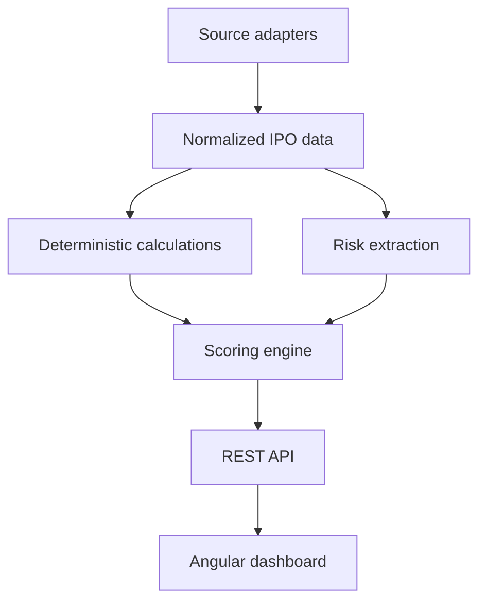

# Architecture

The MVP uses a source-backed calculation pipeline:

The scoring service is intentionally deterministic. A future Spring AI adapter may summarize cited RHP passages, but numeric calculations, hard-risk overrides, confidence, and verdict thresholds remain Java domain logic.

## Data integrity rules

- Missing values remain missing; they are never inferred silently.
- Each market snapshot stores its source URL and observation time.
- Confidence measures evidence coverage, not expected return.
- GMP cannot independently produce an Apply verdict.
- Live source adapters must respect source terms, access controls, and rate limits.

