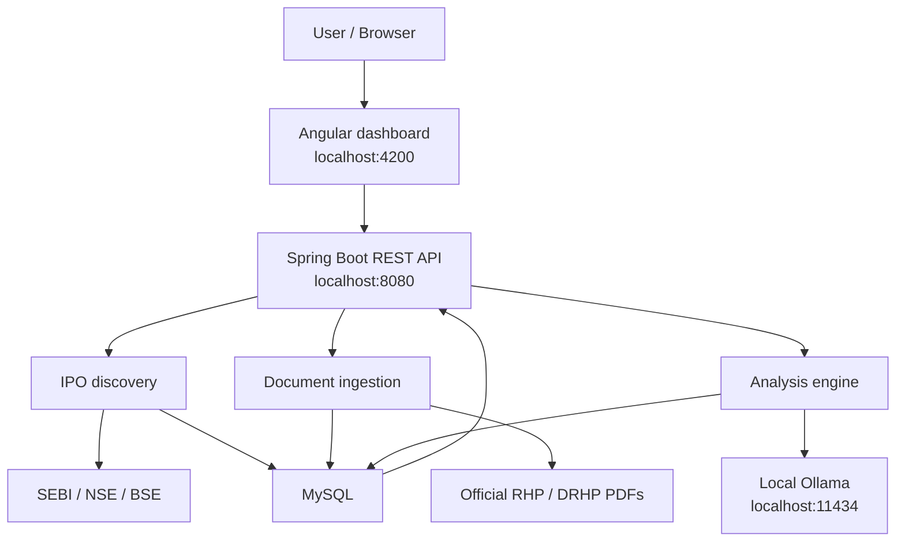
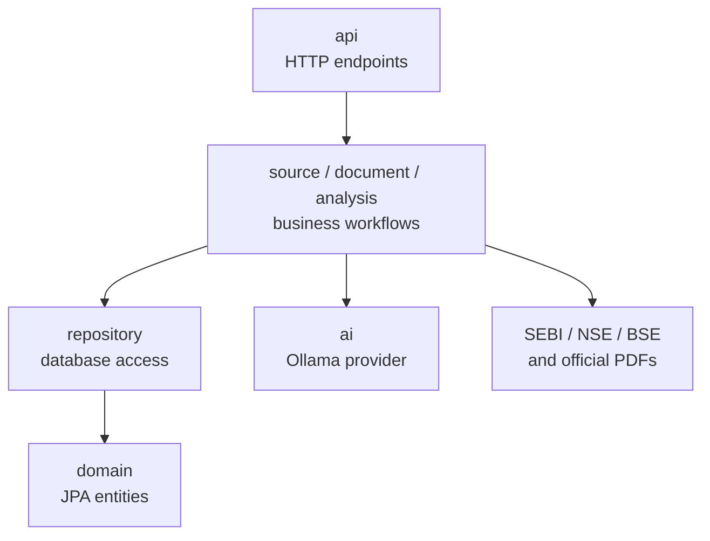
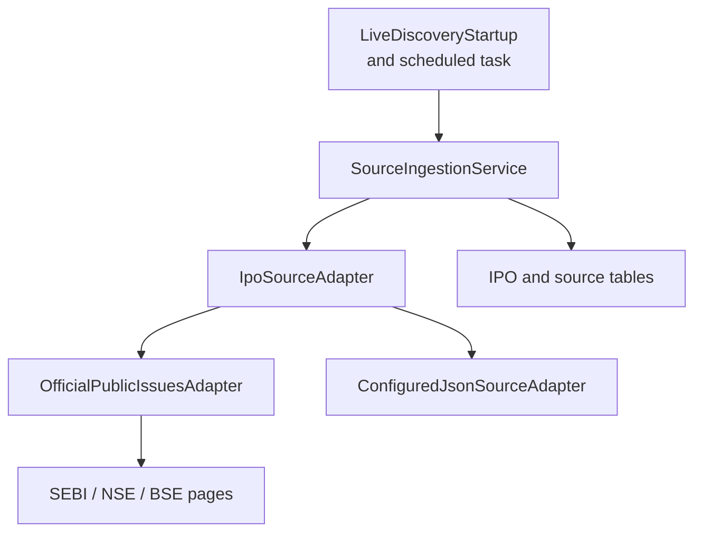
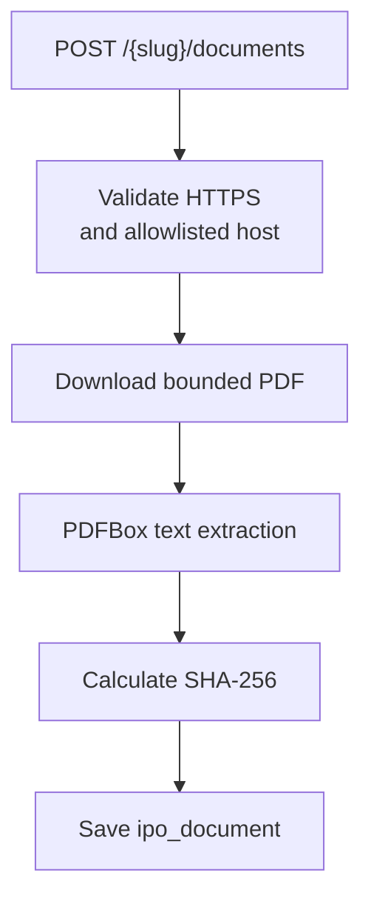
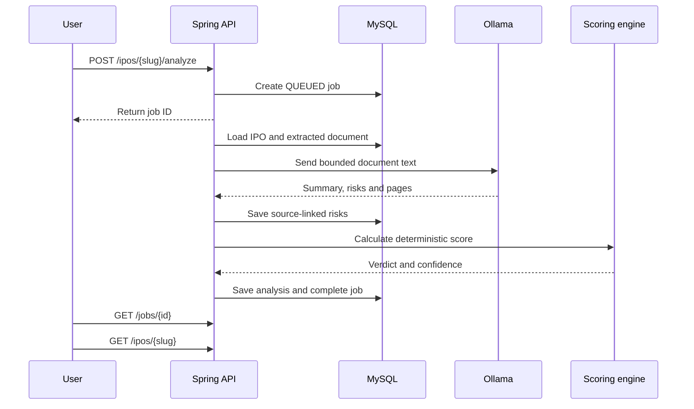
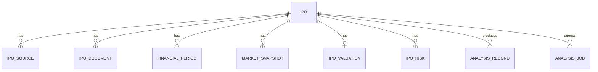
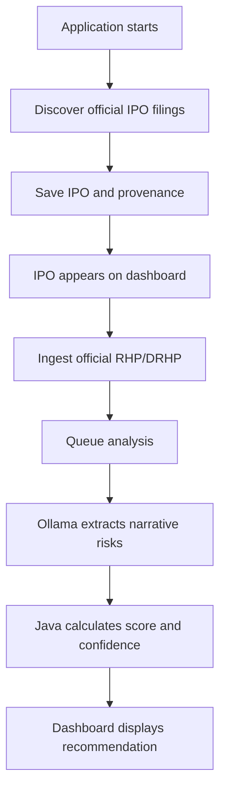

# IPO Analysis Agent — Project Structure

Last reviewed: 6 September 2026

This document describes the repository structure, runtime components, database model, and end-to-end IPO analysis workflow. Update it whenever a controller, service, external source, persistence model, or major workflow changes.

## 1. High-level architecture



The Angular application communicates only with Spring Boot. Spring Boot owns external-source access, validation, analysis, security, and persistence.

## 2. Repository layout

```text
ipo-analysis-agent/
├── frontend/                         Angular dashboard
│   ├── src/app/
│   │   ├── app.component.ts          Dashboard behaviour and API calls
│   │   ├── app.component.html        Dashboard UI
│   │   ├── mini-chart.component.ts   Financial/GMP charts
│   │   └── models.ts                 TypeScript API models
│   ├── proxy.conf.json               Proxies /api to Spring Boot
│   ├── angular.json                  Angular build configuration
│   ├── package.json                  Frontend dependencies and scripts
│   └── Dockerfile
├── src/main/java/com/abikananda/ipo/
│   ├── api/                          REST controllers
│   ├── source/                       SEBI/NSE/BSE discovery
│   ├── document/                     PDF download and extraction
│   ├── ai/                           Ollama/OpenAI integration
│   ├── analysis/                     Scoring and recommendation
│   ├── domain/                       JPA entities
│   ├── repository/                   Spring Data repositories
│   ├── config/                       Security configuration
│   └── IpoAnalysisApplication.java   Application entry point
├── src/main/resources/
│   ├── application.yml               Main configuration
│   ├── application-demo.yml          Demo profile configuration
│   └── db/
│       ├── migration/                Production Flyway migrations
│       └── demo/                     Demo IPO records
├── docker-compose.yml                Frontend, backend and MySQL
├── Dockerfile                        Backend container
├── pom.xml                           Maven dependencies
├── README.md                         Setup and usage
└── .env.example                      Environment-variable examples
```

## 3. Backend packages



### API layer

| Class | Responsibility |
|---|---|
| `IpoController` | IPO list, details, comparison, analysis and history |
| `DiscoveryController` | Manual discovery and latest discovery status |
| `DocumentController` | Official RHP/DRHP document ingestion |
| `JobController` | Asynchronous job status |
| `DashboardController` | Dashboard summary counters |
| `ApiExceptionHandler` | API error responses |

### Source layer



| Class | Responsibility |
|---|---|
| `IpoSourceAdapter` | Common source-collection contract |
| `OfficialPublicIssuesAdapter` | Best-effort parsing of official public pages |
| `ConfiguredJsonSourceAdapter` | Optional normalized JSON source |
| `OfficialFeedConfiguration` | Creates the source adapter beans |
| `SourceIngestionService` | Inserts or updates discovered IPOs and provenance |
| `LiveDiscoveryStartup` | Starts discovery after application startup |

Discovery runs once at startup, every six hours by default, or manually through `POST /api/v1/ipos/discover`.

### Document layer



| Class | Responsibility |
|---|---|
| `DocumentIngestionService` | Validates the URL, downloads the PDF and persists it |
| `PdfDocumentService` | Checks the PDF signature and extracts text |

Document hosts are restricted to configured SEBI, NSE and BSE domains. The default maximum PDF size is 50 MB.

### AI and analysis layers

| Class | Responsibility |
|---|---|
| `AnalysisOrchestrator` | Runs the asynchronous analysis workflow |
| `IpoScoringService` | Calculates deterministic scores and verdict |
| `Recommendation` | Holds the calculated recommendation |
| `OllamaNarrativeAnalyzer` | Extracts bounded summary, risks and page references |
| `OpenAiCompatibleNarrativeAnalyzer` | Optional OpenAI-compatible provider |
| `DisabledNarrativeAnalyzer` | Safe provider when AI is disabled |

Ollama produces narrative findings only. Java owns numeric scoring, confidence, hard-risk overrides, and the final verdict.

## 4. Analysis sequence



Job states are `QUEUED`, `RUNNING`, `COMPLETED`, `PARTIAL`, and `FAILED`. `PARTIAL` means deterministic analysis succeeded but the optional LLM step did not.

## 5. Database relationships



| Entity | Stored information |
|---|---|
| `Ipo` | Company, status, dates, price band, lot and issue size |
| `IpoSource` | Source name, URL, type, reliability and retrieval time |
| `IpoDocument` | Document URL, type, SHA-256, pages and extracted text |
| `FinancialPeriod` | Revenue, profit, cash flow and related financial data |
| `MarketSnapshot` | Time-stamped GMP and subscription observations |
| `IpoValuation` | Valuation and peer comparison data |
| `IpoRisk` | Severity, description, source and document page |
| `AnalysisRecord` | Scores, confidence, verdict, summary and version |
| `AnalysisJob` | Background-job state and error/status message |

## 6. API reference

| Method | Endpoint | Purpose |
|---|---|---|
| `GET` | `/api/v1/ipos` | List dashboard IPOs |
| `GET` | `/api/v1/ipos/{slug}` | Read full IPO details and latest analysis |
| `GET` | `/api/v1/ipos/compare?ids=1,2` | Compare up to four IPOs |
| `POST` | `/api/v1/ipos/discover` | Run source discovery |
| `GET` | `/api/v1/ipos/discovery-status` | Read collector counts and errors |
| `POST` | `/api/v1/ipos/{slug}/documents` | Download and extract an official PDF |
| `POST` | `/api/v1/ipos/{slug}/analyze` | Queue analysis |
| `GET` | `/api/v1/jobs/{jobId}` | Poll analysis status |
| `GET` | `/api/v1/ipos/{slug}/recommendation-history` | Read historical analyses |
| `GET` | `/api/v1/dashboard/summary` | Read dashboard counters |

GET endpoints are public. State-changing API calls require HTTP Basic authentication. The default generated Spring Security username is `user`.

## 7. End-to-end operating flow



Current boundary: IPO discovery is scheduled, while document ingestion and analysis are triggered separately. Public NSE and BSE pages may return client-rendered content or deny automated access, and their failures remain visible through the discovery-status API.

## 8. Maintenance checklist

Update this document when any of the following changes:

1. A controller or API endpoint is added, removed, or renamed.
2. An external IPO, GMP, financial, or document source changes.
3. A database entity or Flyway relationship changes.
4. The Ollama prompt, schema, model, limits, or responsibilities change.
5. Scoring weights or recommendation rules change.
6. A manual workflow becomes scheduled or fully automated.
7. The Angular dashboard gains a new data flow or major component.

When requesting an update, reference `docs/PROJECT_STRUCTURE.md` and describe the feature or modification that was made.
